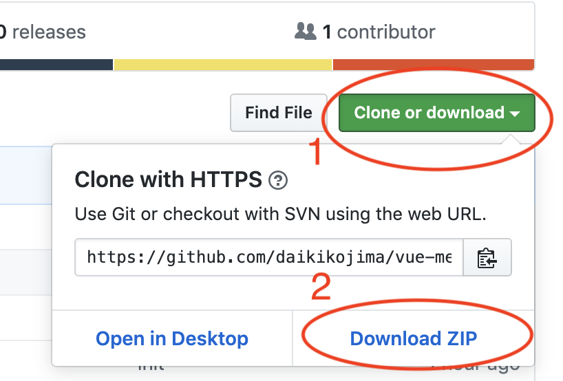

# Todo App for Vue.js
Vue.jsでTodoアプリを作ってみよう
デモは[こちら](https://daikikojima.github.io/vue-memo/)
## 概要
Web meetup #2のハンズオン用の素材となります。

## 手順

### Git詳しくない人

1のボタンを押すと、`Clone with HTTPS`
が表示されます。
2のボタンを押してファイルをダウンロードしてください。

### Gitできる人
```
git clone https://github.com/daikikojima/vue-memo.git
```
で`clone`してください

## 事前準備
依存パッケージが必要ですので、
プロジェクトファイルで
```
npm ci
```
をターミナルで実行してください。

## 実行
```
npm run serve
```
をターミナルで入力すると実行できます。

## 補足 (VS Code向け)

### ターミナルの出し方

1. 囲っている部分をクリックします。


2. すると、このような画面が出るので`ターミナル`をクリック


### おすすめのプラグイン

[Vetur](https://marketplace.visualstudio.com/items?itemName=octref.vetur)

[Auto Close Tag](https://marketplace.visualstudio.com/items?itemName=formulahendry.auto-close-tag)
